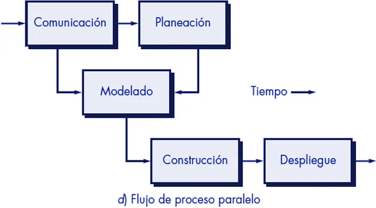
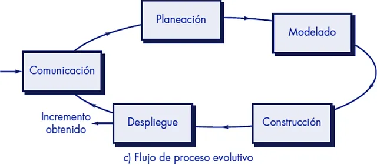
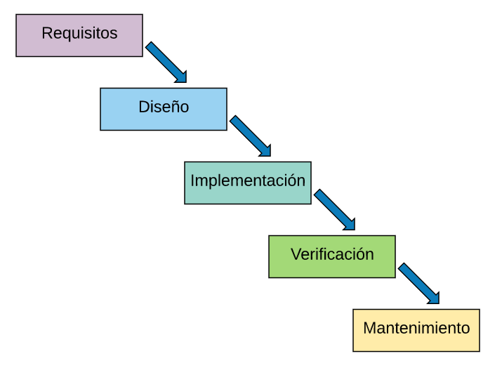
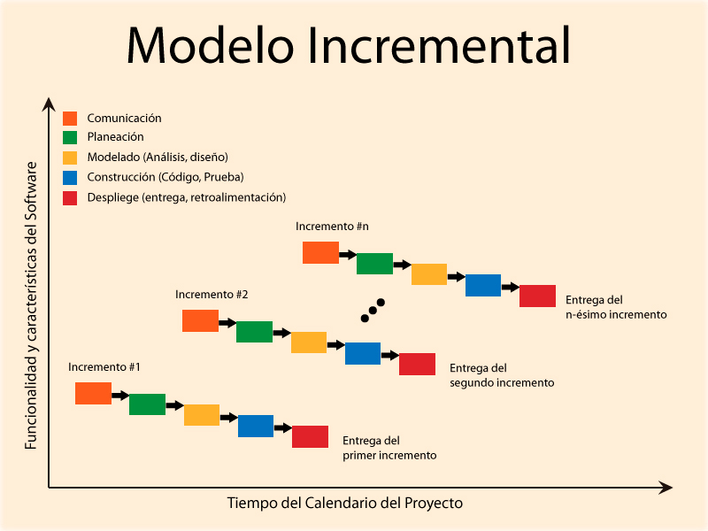
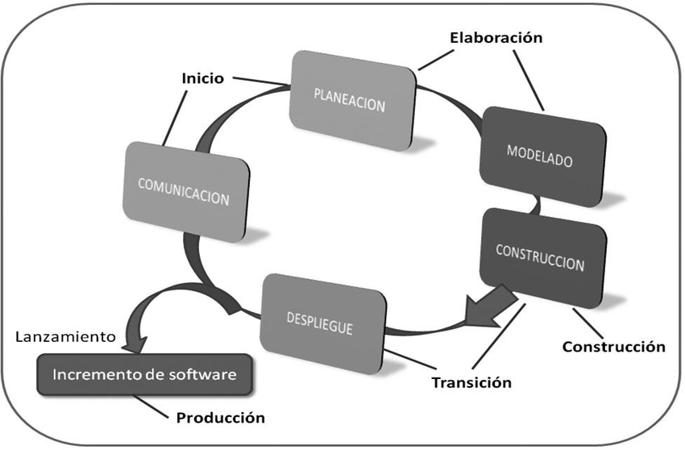

# Procesos del Software

## ¿Qué es el software?

**Software**[(1)](#bibliografía) es el sistema formal[(2)](#bibliografía) de un sistema informático, que comprende el conjunto de los componentes lógicos necesarios que hace posible la realización de tareas específicas, en contraposición a los componentes físicos que son llamados hardware. El software es, por ende, el que transmite órdenes al hardware para que este funcione. Básicamente, se trata de un intermediario entre tú y la máquina.

El software se puede separar en tres categorías principales:

### Software de Sistema

El software de sistema es todo aquel que vincula adecuadamente tanto al programador como al usuario a la máquina. Procura interfaces de alto nivel para aislarlos de aspectos físicos como memooria, procesamiento, puertos, teclados, etc. Incluye:
- Sistemas operativos
- BIOS
- Controladores
- Servidores

### Software de Programación

El software de programación son todas aquellas que permiten al programador crear aplicaciones informáticas usando diferentes lenguajes de programación. Se incluyen:
- Compiladores
- Editores de Texto
- IDEs
- Intérpretes

### Software de Aplicación

Es todo aquel que permite al usuario llevar a cabo una o varias tareas específicas. En esta categoría se incluyen:
- Programas de ofimática
- Bases de datos
- Software médico
- Telecomunicaciones
- Videojuegos

## ¿Quién lo construye?

Los técnicos e ingenieros del software que van a analizar una solución real y diseñar una aplicación (en este caso informática) y todo lo que ello conlleva. Arquitectura, patrones, costos, etc.

## ¿Cómo se construye?

El sofware no se construye, se desarrolla. Esto implica que vamos a tener un proceso de planificación y modelado además de la propia construcción del programa.
El desarrollo de software se puede separar en dos bloques, uno **estructural** y otro **sombrilla** que, aunque no sea explícitamente necesario para que un software pase de la nada a hecho, sí que contribuye en sobremanera a crear un mejor sistema.

### Actividades Estructurales

#### Requisitado/Comunicación
Lo primero que necesitamos es el conocimiento de que alguien o algo necesita una solución informática a resolver. Hay que mantener una buena comunicación y sonsacar todo lo necesario para que el software se considere finalizado (el llamado *scope*). Aquí se nos comunicarán las horquillas de tiempo en las que el proyecto debe estar finalizado, incluso con fecha final.

Esta comunicación puede darse tanto al principio como de manera constante, implicando al cliente en el proceso del desarrollo.

#### Planificación
Aquí deberemos acotar los otros retos de un software. Elegir las tecnologías, dar formato a las funcionalidades recibidas, y otros aspectos que darán pie a la asignación de costes. También analizar la viabilidad del proyecto, para determinar si lo pedido es factible, o analizar los riesgos para estar preparados ante cualquier situación, son actividades dentro de esta fase.

#### Modelado
Toca empezar a diseñar la solución. Para ello debemos tener en cuenta todos los entornos y funciones que va a tener nuestro software.
Si va a tener una **base de datos**, deberemos diseñar una estructura que facilite la implementación y su posterior mantenimiento y evolución. Estos datos, deberán tener bien específicados cómo se van a mover a través del sistema con diagramas. Un buen diagrama, puede ayudar a trazar dónde esta el fallo antes de construir siquiera el software.

También es imporante comenzar a diseñar las **interfaces de usuario** y que el cliente vaya aceptando el aspecto visual del mismo. Esto ayudará a que el flujo de uso de una aplicación sea lo más fluido posible y no crear una aplicación con una barrera de entrada alta para el usuario.

#### Construcción
Llegamos a a la hora de aplicar los conocimientos técnicos. Ya teniendo la selección de la tecnología, los diseños en los datos y en la interfaz, y demás asuntos, toca programar tanto el producto en sí como las pruebas.

También puede ser el momento de desarrollar herramientas y automatizaciones que ayuden tanto al proceso de construcción como de despliegue.

#### Despliegue
Por último, una vez creado y probado el software (tanto internamente como con el cliente en una fase beta del producto), toca desplegar.
Ahora ya se puede interactuar con una versión concreta del producto y que el cliente (u otros usuarios) va a poder usar de manera libre.

Esta fase es de las más cortas si hemos hecho bien las anteriores, y es dónde los problemas más críticos pueden salir a la luz. Cualquier fallo es visto como una mella en la defición de buen software y, por consiguiente, en la confianza del usuario.

### Actividades Sombrilla
Como hemos dicho, las **actividades sombrilla** no son cruciales para el desarrollo de un software, pero sí para el desarrollo de un *buen software*. 
Entre estas actividades se encuentran todas aquellas relacionadas con el **seguimiento y control** de los procesos y productos; la **administración de riesgos** para poder gestionarlos lo mejor posible; el **aseguramiento de la calidad** ya sea en código mediante patrones, sintáxis, etc. o la calidad del conjunto gracias a la realización de pruebas.

Las **revisiones técnicas y de configuración** también sono importantes para mantener nuestro programa actualizado y a punto tanto en la parte tecnológica cómo en la que aborda la configuración del mismo.

## Procesos del Software[(3)](#bibliografía)

### Proceso Lineal
El proceso lineal sigue la línea "natural" de las actividades y cada actividad comienza cuando acaba la otra.

### Proceso Iterativo
El proceso iterativo tiene la ventaja de poder mejorar cada actividad y volver a ella antes de pasar a la siguiente. Muy útil para crear entregables con calidad.

### Proceso Paralelo
El proceso paralelo permite ejecutar una o más actividades en paralelo mientras las demás se están realizando.

### Proceso Evolutivo
El proceso evolutivo itera sobre sí mismo, creando un círculo completo de actividades y creando un incremento en el valor del software con cada iteración. Útil para la entrega continua de entregables.

## Modelos de Desarrollo de Software
El modelo puede utilizar cualquier proceso para generar pasos que se ejecutan de distintas maneras. Los modelos más usados son:

### Modelo en cascada
Muy similar al proceso lineal, cada fase se completa antes de pasar a la siguiente.

### Modelo en cascada en V
Primero realizamos el proceso lineal clásico en cascada, y volvemos atrás paso a paso confirmando y corrigiendo mediante distintos tipos de pruebas.

### Modelo de procesos incrementales
Con un proceso en cascada vamos añadiendo valor en cada iteración.

### Modelo de procesos evolutivo
Con un proceso incremental vamos añadiendo valor en cada iteración.

### Modelo Unificado
El modelo unificado se caracteriza por trabajar sobre todo el trabajo anterior. Sería una suma de los procesos iterativos e incremental. Es uno de los modelos más usados hoy en día.

## ¿Qué hace bueno a un software?

Aunque la palabara *bueno* es subjetiva y depende tanto de a quien le preguntes y del proyecto. Existen varios frentes a los que poner especial énfasis cuando quieres construir un software considerado bueno o que tienda a ser bueno:

### Mantenible
El software construido debe ser mantenible en el tiempo. Debe poder entenderse su código, su arquitectura y sus procesos e integraciones para que, en el futuro, cuando los equipos muden de personal, el tiempo de adaptación sean los mínimos (incluso ninguno y que con una leída ya sea suficiente para entender el sistema).

Esto aportará a que el software sea más fácil de evolucionar o corregir.

### Seguro
El ingeniero debe procurar que todo sistema creado sea lo menos vulnerable posible a modificaciones no deseadas. Esa íntegridad de los procesos, datos y demás partes del software es lo que va a aportar a la confianza del mismo.

### Confiable
La confiabilidad no sólo viene de cuán seguro sea nuestro software. También debemos ofrecer las funciones y comportamiento deseado y esperado por lo acordado por el cliente.

Tener el comporamiento esperado del software y la integridad de la información es tan clave que es el primer punto esperado en un entorno profesional.

### Eficiente
La eficiencia es el punto más flexible de todos si se cumplen los demás. Un buen ingeniero va a tener en mente un la eficiencia en su solución infomática, pero no siempre es posible. 

Lo que se debe evitar a toda cosa es desperdiciar recursos sin justificar. Toda decisión que afecte a este punto debe ser analizada y sopesada para poder equilibrar correctamente calidad y eficiencia.

### Adaptable
El software, sobre todo si va a relacionarse con más sistemas, debe ser flexible a integraciones, tanto hacia nuestro sistema como hacia sistemas externos.

Este punto requiere una visión más global del software y el razonamiento en varias capas para tener una comprensión completa de los posibles riesgos y beneficios de cada integración.

## ¿Cuáles son los retos del software?

Para crear un software, siempre tendremos ciertas limitaciones a las que tendremos que atender en nuestro diseño. Como ingenieros deberemos tener en cuenta los siguientes aspectos:

1. Tiempo
2. Calidad
3. Mantenimiento
4. Reusabilidad
5. El usuario final

Estos cinco puntos deben equilibrarse para que todos queden satisfechos.

## Bibliografía

1. [Wikipedia - Software](https://es.wikipedia.org/wiki/Software)
2. [Wikipedia - Sistema Formal](https://es.wikipedia.org/wiki/Sistema_formal)
3. [Medium - Procesos desarrollo Software](https://medium.com/@ramiroec/procesos-de-desarrollo-de-software-d06d18ebd78f)

